Advanced Middleware RPC Dynamic Types API Specification
=======================================================

Introduction
------------
### Purpose

The purpose of this document is to specify the dynamic Remote Procedure Call (RPC) Application Programming Interface (API) for the Advanced Middleware GE.

### Revision History

| **Date**         | **Description**               | 
|------------------|-------------------------------|
| 30-January-2015  | Frist release                 |
| 04-February-2015 | Update after review meeting   |
| 06-March-2015    | Release 0.2.0                 |

### Reference Material

- [*Advanced Middleware IDL Specification*][AMiIDLSpec]
- [*Advanced Middleware RPC API Specification*][AMiRPCSpec]

[AMiIDLSpec]: ./Middleware_IDL_Specification.md "Advanced Middleware IDL Specification"
[AMiRPCSpec]: ./Middleware_RPC_API_Specification.md "Advanced Middleware RPC API Specification"
[AMiRPCDynSpec]: ./Middleware_RPC_Dynamic_Types_API_Specification.md "Advanced Middleware RPC Dynamic Types API Specification"


A quick Example
---------------

Before the description of the public Advanced Middleware RPC Dynamic Types  API, a quick example is provided. This example shows how a client should use this dynamic API framework to call a remote server and how a server can send the response. 

First of all, let’s bear in mind that the server provides an IDL defining the services and their functions. The example uses the following Advanced Middleware interface definition:

```
service Calculator
{
    i32 add(i32 num1, i32 num2);
};
```

### Loading the services’ definitions

To be able to call remote functions dynamically, it is required to know the services and what functions they offer. The use case is to load the `TypeCode`elements when creating the connection, so it will be the `Connection` class which offers an API to get all the data definitions from the server.

### Creating a client

On the client side, there is no differnce between the dynamic and the static API from the developers point of view in terms of creating the connection. In the dynamic case this connection will be used to obtain all the types and functions offered by the server.

This means, the user has to create a connection and then use it to get a definition of the function he wants to execute. Let’s walk through it based on the following example.

```java
// Create context and connect with the server
Context context = Kiara.createContext();
Connection connection = context.connect("kiara://127.0.0.1:8080/service");
        
// Get a generic proxy based on the service interface
 DynamicProxy client = connection.getDynamicProxy("Calculator");
```

When connecting to the server, the scheme specified in the URI is used by the Context to decide from where to download the information. In this example, the scheme “kiara” means the connection information is going to be downloaded from the server and then used in the negotiation process. Otherwise, information such as the transport protocol and serialization mechanism must be specified in the URI itself.

Before being able to call remotely a function on the server, the client will need to have access to its functions, and in a typical RPC framework, this can be done by using a Proxy. The class named `DynamicProxy` allows the user to have access to this information from the data that has been downloaded from the server.

To do so, the `Connection` object offers a function called `getDynamicProxy`, which looks inside the dynamic data types created when connecting to the server and retrieves a `DynamicProxy` whose name is the same as the service name specified as a parameter.

Once the user has obtained this `DynamicProxy`, all the functions defined inside the service are available. To use them, two objects are necessary, the `DynamicFunctionRequest` and the `DynamicFunctionResponse`.

The `DynamicFunctionRequest` object is created at run-time by using the name of the function the user wants to execute on the server’s side. If there is a function whose name fits the one specified, this object will be filled with all the `DynamicValue` objects necessary to execute the function.

On the other hand, the DynamicFunctionResponse object will be created and filled with the response obtained from the server after the execution is finished (either if it finished properly or not).

```java
// Create the function request
DynamicFunctionRequest request = dclient.createFunctionRequest("add");
((DynamicPrimitive) request.getParameterAt(0)).set(3.5);
((DynamicPrimitive) request.getParameterAt(1)).set(5.2);

// Execute the Remote Procedure Call
DynamicFunctionResponse response = drequest.execute();
```

In this example, the `createFunctionRequest` method has been executed specifying “add as” the function name. Therefore, the `DynamicFunctionRequest` object will have two primitive `DynamicValue` objects (`DynamicPrimitive`) inside (one for each parameter defined in the IDL description of the function). The user can easily modify these values and call the execute method on the request object, obtaining this way a `DynamicFunctionResponse` which holds the result of the function execution.

The `execute` method will have all the business logic so that the service name, the operation name, message ID, etc. as well as all the parameters are serialized properly according to the function that is going to be executed.

The same thing happens with the return type of each function. Depending on the `DynamicValue` that defines it, a different deserialization method will be executed. By using this method, the user only has to specify which function must be executed on the server’s side, and all the information will be (de)serialized automatically.

In order to know if the function finished the way it should, the `DynamicFunctionResponse` object offers a function named `isException`, which will return true if and only if the function did raise an exception. The following code snippet shows this behaviour:

```java
// Check RPC result
if (dresponse.isException()) {
    DynamicData result = dresponse.getReturnValue();
    System.out.println("Exception = " + (DynamicPrimitive) result);
} else {
    DynamicData result = dresponse.getReturnValue();
    System.out.println("Result = " + ((DynamicPrimitive) result).get());
}
```

API Overview
------------
This section enumerates and describes the classes provided by Advanced Middleware Dynamic Types RPC API.


### Main entry point

#### org.fiware.kiara.Kiara

This class is the main entry point to use Advanced Middleware middleware. It creates or provides implementation of top level Advanced Middleware interfaces, especially `Context`.

**Functions**:

- **getTypeDescriptorBuilder**: This function returns an instance of the type `DescriptorBuilder` described below.
- **getDynamicValueBuilder**: This function returns an instance of the `DynamicValueBuilder` described below.
- **createContext**: This function creates a new instance of the Context class, which is part of the public [Advanced Middleware RPC API][AMiRPCSpec] .
- **shutdown**: This function closes releases all internal Advanced Middleware structures, and is a part of the public [Advanced Middleware RPC API][AMiRPCSpec].


### Serialization mechanisms

#### org.fiware.kiara.serialization.Serializer

This interface is part of the public [Advanced Middleware RPC API][AMiRPCSpec].


#### org.fiware.kiara.serialization.impl.Serializable

This interface is the one that must be implemented by all the used defined data types in order to be serializable. It defines the methods `serialize` and `deserialize` for each data type. This class will not be described in this document, for more information take a look at the [Advanced Middleware RPC API Specification][AMiRPCSpec] document.


### Client API

#### org.fiware.kiara.client.Connection

The `Connection` interface manages the connection to the server. It holds the required `Transport` objects and `Serialization` objects. Also it can create these object automatically depending on the server information. The connection provides the service proxy interfaces, which will be used by the application to call remote functions.

**Functions:**

- **getDynamicProxy**: This function looks in the endpoint for a service whose name is the same as the one specified as a parameter, and creates a new `DynamicProxy` representing that service. This `DynamicProxy` will provide the user with all the functions defined in such a service.


### TypeDescriptor

This subsection contains the interfaces and classes that are dependent on the user. This section will use the example in section API Usage Examples to define them.

 
<center>Figure: Class Diagram TypeDescriptor</center>

---
#### org.fiware.kiara.typecode.TypeDescriptorBuilder

This interface defined the operations used to create type-describing objects. It allows the users to create every supported data type inside Advanced Middleware by acting as a single access builder.

**Functions:**

- **createVoidType:** This function creates a new `DataTypeDescriptor` representing a void data type..
- **createPrimitiveType:** This function returns a new `PrimitiveTypeDescriptor` whose kind is the same specified as a parameter.
- **createArrayType**: Function that creates a new `ArrayTypeDescriptor` object representing an array.
- **createListType**: This function creates a new `ListTypeDescriptor` object representing a list of objects.
- **createSetType**: Function that creates a new `SetTypeDescriptor` object representing a set. A set is defined as a list with no repeated objects.
- **createMapType**: This function is used to create a `MapTypeDescriptor` object that represents a map data type.
- **createStructType**: This function creates a new `StructTypeDescriptor` object representing a struct data type.
- **createEnumType**: Function that creates a new `EnumTypeDescriptor` object representing an enumeration.
- **createUnionType**: This function can be used to create a new `UnionTypeDescriptor` that represents a union data type.
- **createExceptionType**: Function that creates a new `ExceptionTypeDescriptor` used to represent an exception data type.
- **createFunctionType**: This function can be used to create a new `FunctionTypeDescriptor` representing a Remote Procedure Call (RPC).
- **createServiceType**: Function that creates a new `ServiceTypeDescriptor` object used to represent a service defined in the server’s side.

---
#### org.fiware.kiara.typecode.TypeDescriptor

This class is used to manipulate the objects used to describe the data types. It allows the users to know what type of data an object represents.

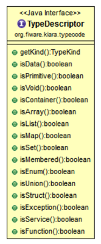  
<center>Figure: Interface TypeDescriptor</center>

**Functions:**

- **getKind:** Function that returns the `TypeKind` of a `TypeDescriptor` object.
- **isData:** This function returns true if and only if the `TypeDescriptor` represented by the object in which is invoked describes a data type. Functions and services are not considered data types.
- **isPrimitive:** Function used to know if a `TypeCode` object is a description of a primitive data type.
- **isVoid:** This function returns true if the `TypeDescriptor` object represents a void data type.
- **isContainer:** This function can be used to check if a `TypeDescriptor` object is representing a container type. The types considered as container data types are arrays, lists, sets and maps.
- **isArray:** Function used to know if a `TypeDescriptor` object is a description of an array data type.
- **isList:** Function used to know if a `TypeDescriptor` object is a description of a list data type.
- **isMap:** Function used to know if a `TypeDescriptor` object is a description of a map data type.
- **isSet:** Function used to know if a `TypeDescriptor` object is a description of a set data type.
- **isMembered:** This function is used to know if a `TypeDescriptor` object is a description of a membered data type. `Membered` types are structs, enumerations, unions and exceptions.
- **isStruct:** Function used to know if a `TypeDescriptor` object is a description of a struct data type.
- **isEnum:** Function used to know if a `TypeDescriptor` object is a description of an enumeration data type.
- **isUnion:** Function used to know if a `TypeDescriptor` object is a description of a union data type.
- **isException:** Function used to know if a `TypeDescriptor` object is a description of an exception data type.
- **isFunction:** Function used to know if a `TypeDescriptor` object is a description of a function.
- **isService:** Function used to know if a `TypeDescriptor` object is a description of a service.

---
#### org.fiware.kiara.typecode.data.DataTypeDescriptor

Interface that represents the top level class of the data type hierarchy. It is used as a generic type to englobe only and exclusively data type descriptors.

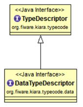  
<center>Figure: Interface DataTypeDescriptor</center>

**Functions**: None

---
#### org.fiware.kiara.typecode.data.PrimitiveTypeDescriptor

Interface that represents a primitive data type. Primitive types include **boolean**, **byte**, **i16**, **ui16**, **i32**, **ui32**, **i64**, **ui64**, **float32**, **float64**, **char** and **string**.

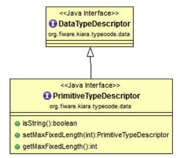  
<center>Figure: Interface PrimitiveTypeDescriptor</center>

**Functions:**

- **isString**: This function returns true if and only if the `PrimitiveTypeDescriptor` object represents a string data type.
- **setMaxFixedLength**: This function can only be used with string types. It sets the maximum length value for a specific string represented by the `PrimitiveTypeDescriptor` object.
- **getMaxFixedLength**: This function returns the maximum length specified when creating the `PrimitiveTypeDescriptor` object if it represents a string data type.

---
#### org.fiware.kiara.typecode.data.ContainerTypeDescriptor

Interface that represents a container data type. Container data types are **arrays**, **lists**, **maps** and **sets**.

  
<center>Figure: Interface ContainerTypeDescriptor</center>

**Functions:**

- **setMaxSize**: This function sets the maximum size of a container data type.
- **getMaxSize**: This function returns the maximum size of a container data type.

---
#### org.fiware.kiara.typecode.data.ArrayTypeDescriptor

Interface that represents an array data type. Arrays can hold multiple repeated objects of the same data type inside.

  
<center>Figure: Interface ArrayTypeDescriptor</center>


**Functions:**

- **getElementType**: This function returns the `DataTypeDescriptor` object describing the content type of the array.
- **setElementType**: This function sets the `DataTypeDescriptor` object describing the content type of the array.
- **setDimensions**: This method sets the dimensions of the array.
- **getDimensions**: This method returns the different dimensions of the array.

---
#### org.fiware.kiara.typecode.data.ListTypeDescriptor

Interface that represents a list data type. Lists can hold multiple repeated objects of the same data type inside.

  
<center>Figure: Interface ListTypeDescriptor</center>

**Functions:**

- **getElementType**: This function returns the `DataTypeDescriptor` object describing the content type of the list.
- **setElementType**: This function sets the `DataTypeDescriptor` object describing the content type of the list.

---
#### org.fiware.kiara.typecode.data.SetTypeDescriptor

Interface that represents a set data type. Sets can have non repeated objects of the same data type inside.

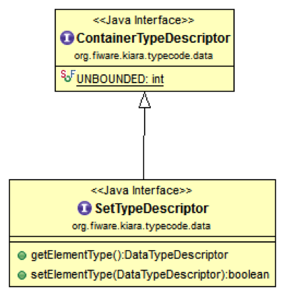  
<center>Figure: Interface SetTypeDescriptor</center>

**Functions:**

- **getElementType**: This function returns the `DataTypeDescriptor` object describing the content type of the set.
- **setElementType**: This function sets the `DataTypeDescriptor` object describing the content type of the set.

---
#### org.fiware.kiara.typecode.data.MapTypeDescriptor

Interface that represents a map data type. Maps can hold multiple key-object pairs inside if and only if the key objects are unique.

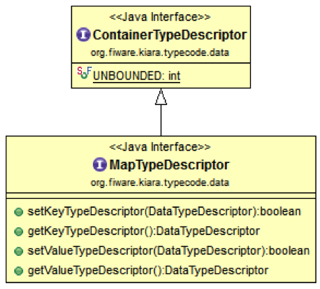  
<center>Figure: Interface MapTypeDescriptor</center>

**Functions:**

- **getKeyTypeDescriptor**: This function returns the `DataTypeDescriptor` object describing the key type of the map.
- **setKeyTypeDescriptor**: This function sets the `DataTypeDescriptor` object describing the key type of the map.
- **getValueTypeDescriptor**: This function returns the `DataTypeDescriptor` object describing the value type of the map.
- **setValueTypeDescriptor**: This function sets the `DataTypeDescriptor` object describing the value type of the map.

---
#### org.fiware.kiara.typecode.data.MemberedTypeDescriptor

Interface that represents a membered data type. `Membered` data types are **structs**, **enumerations**, **unions** and **exceptions**.

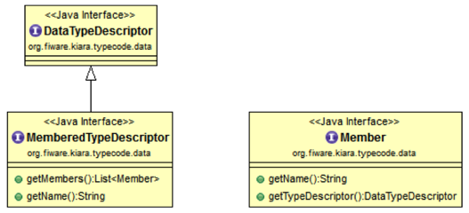  
<center>Figure: Interface MemberedTypeDescriptor</center>

**Functions:**

- **getMembers**: This function returns the list of member objects stored in a `ContainerTypeDescriptor` object.
- **getName**: This function returns the name of the `ContainerTypeDescriptor` object.

---
#### org.fiware.kiara.typecode.data.StructTypeDescriptor

Interface that represents a struct data type. Structs can have multiple different `DataTypeDescriptor` objects inside stored as members. Every struct member is identified by a unique name.

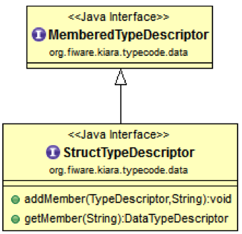  
<center>Figure: Interface StructTypeDescriptor</center>

**Functions:**

- **addMember**: This function adds a new `TypeDescriptor` object as a member using a specific name.
- **getMember**: This function returns a `DataTypeDescriptor` object identified by the name introduced as a parameter.

---
#### org.fiware.kiara.typecode.data.EnumTypeDescriptor

Interface that represents an enumeration data type. Enumerations are formed by a group of different string values.

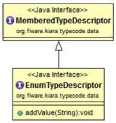  
<center>Figure: Interface EnumTypeDescriptor</center>

**Functions:**

- **addValue**: This function adds a new value to the enumeration using the string object received as a parameter.

---
#### org.fiware.kiara.typecode.data.UnionTypeDescriptor

Interface that represents a union data type. Unions are formed by a group of members identified by their names and the labels of the discriminator to which they are assigned.

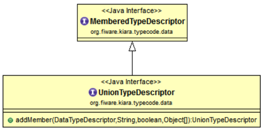  
<center>Figure: Interface UnionTypeDescriptor</center>

**Functions:**

- **addMember**: This function adds a new `TypeDescriptor` object as a member using a specific name and the labels of the discriminator.

---
#### org.fiware.kiara.typecode.data.ExceptionTypeDescriptor

Interface that represents a struct data type. Exceptions can have multiple different `DataTypeDescriptor` objects inside stored as members. Every struct member is identified by a unique name.

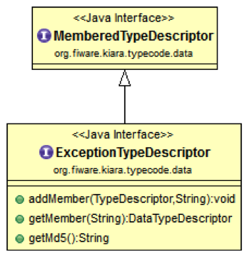  
<center>Figure: Interface ExceptionTypeDescriptor</center>

**Functions:**

- **addMember**: This function adds a new `TypeDescriptor` object as a member using a specific name.
- **getMember**: This function returns a `DataTypeDescriptor` object identified by the name introduced as a parameter.
- **getMd5**: This function returns the Md5 hash string of the exception name.

---
#### org.fiware.kiara.typecode.data.Member

Interface that represents a member of a `MemberedTypeDescriptor` object. Each member is identified by its name and the `TypeDescriptor` object that it holds.

  
<center>Figure: Interface Member</center>

**Functions:**

- **getName**: This function returns the member’s name.
- **getTypeDescriptor**: This function returns a `DataTypeDescriptor` object stored inside the member.

---
#### org.fiware.kiara.typecode.data.EnumMember

Interface that represents a member of a `EnumTypeDescriptor` object. It inherits from `Member` interface and therefore it has no new methods.

  
<center>Figure: Interface EnumMember</center>

**Functions:** None

---
#### org.fiware.kiara.typecode.data.UnionMember

Interface that represents a member of a `UnionTypeDescriptor` object. It inherits from Member interface and therefore it has no new methods.

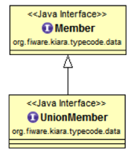  
<center>Figure: Interface UnionMember</center>

**Functions:** None

---
#### org.fiware.kiara.typecode.services.FunctionTypeDescriptor

This interface represents a function, providing methods to easily describe it by setting its return type, parameters and exceptions that it might throw.

  
<center>Figure: Interface FunctionTypeDescriptor</center>

**Functions:**

- **getReturnType**:This function returns the return `DataTypeDescriptor` of the function.
- **setReturnType**: This function sets the return `DataTypeDescriptor` of the function.
- **getParameter**: This function returns a `DataTypeDescriptor` representing a parameter whose name is the same as the one indicated.
- **addParameter**: This function adds a new `DataTypeDescriptor` to the parameters list with the name indicated.
- **getException**: This function returns an `ExceptionTypeDescriptor` whose name is the same as the one specified as a parameter.
- **addException**: This function adds a new `ExceptionTypeDescriptor` to the exceptions list.
- **getName**: This function returns the function name.
- **getServiceName**: This function returns the name of the `ServiceTypeDescriptor` in which the `FunctionTypeDescriptor` is defined.
- **setServiceName**: This function sets the name of the `ServiceTypeDescriptor` in which the `FunctionTypeDescriptor` is defined.

---
#### org.fiware.kiara.typecode.services.ServiceTypeDescriptor

This interface represents a service, providing methods to add the FunctionTypeDescriptor objects representing every function defined in a specific service.

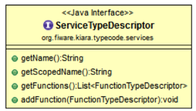  
<center>Figure: Interface ServiceTypeDescriptor</center>

**Functions:**

- **getName**: This function returns the service name.
- **getScopedName**: This function returns the service scoped name.
- **getFunctions**: This function returns the list of `FunctionTypeDescriptor` objects stored inside the `ServiceTypeDescriptor`.
- **addFunction**: This function adds a `FunctionTypeDescriptor` to the list of functions defined inside the service.


### Dynamic

This subsection contains the interfaces and classes that are designed to provide the developer with functions to create and manage dynamic data types.

  
<center>Figure: Class Diagramm DynamicValue</center>

---
#### org.fiware.kiara.dynamic.DynamicValueBuilder

This class allows the users to create new data types based on their `TypeCode` descriptions.

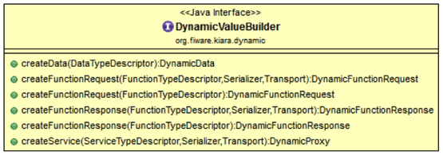  
<center>Figure: Interface DynamicValueBuilder</center>

**Functions:**

- **createData:** This function allows the user to create new `DynamicData` objects by using their `TypeDescriptor`.
- **createFunctionRequest:** This function receives a `FunctionTypeDescriptor` object describing a function, and it generates a new `DynamicFunctionRequest` (which inherits from `DynamicData`) object representing it.
- **createFunctionResponse:** This function receives a `FunctionTypeDescriptor` object describing a function, and it generates a new `DynamicFunctionResponse` (which inherits from `DynamicData`) object representing it.
- **createService:** This function receives a `ServiceTypeDescriptor` object describing a function, and it creates a new `DynamicService` object representing it.

---
#### org.fiware.kiara.dynamic.DynamicValue

Interface that acts as a supertype for every dynamic value that can be managed. Every `DynamicValue` object is defined by using a `TypeDescriptor` which is used to describe the data. It defines the common serialization functions as well as a function to retrieve the `TypeDescriptor` object it was created from.

  
<center>Figure: Interface DynamicValue</center>

**Functions:**

- **getTypeDescriptor**: This function returns the TypeDescriptor used when creating the DynamicValue object.
- **serialize:** This function serializes the content of the DynamicValue object inside a BinaryOutputStream message.
- **deserialize:** This function deserializes the content of a BinaryInputStream message into a DynamicValue object.

---
#### org.fiware.kiara.dynamic.data.DynamicData

Interface that is used to group all the `DynamicValues` representing data types.

  
<center>Figure: Interface DynamicData</center>

**Functions:** None

---
#### org.fiware.kiara.dynamic.data.DynamicPrimitive

This class allows the users to manipulate `DynamicData` objects made from `PrimitiveTypeDescriptor` objects.

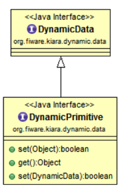  
<center>Figure: Interface DynamicPrimitive</center>

**Functions:**

- **set:** This function sets the inner value of a `DynamicPrimitive` object according to the `TypeDescriptor` specified when creating it.
- **get**: This function returns the value of a `DynamicPrimitive` object.

---
#### org.fiware.kiara.dynamic.data.DynamicContainer

This class holds the data values of a `DynamicData` object created from a `ContainerTypeDescriptor`.

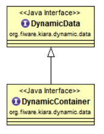  
<center>Figure: Interface DynamicContainer</center>

**Functions:** None

---
#### org.fiware.kiara.dynamic.data.DynamicArray

This class holds the data values of a `DynamicData` object created from an `ArrayTypeDescriptor`. A `DynamicArray` contains a group of `DynamicData` objects (all must be the same type) stored in single or multi dimensional matrixes.

  
<center>Figure: Interface DynamicArray</center>

**Functions:**

- **getElementAt:** This function returns `DynamicData` object stored in a certain position or coordinate..
- **setElementAt**: This function sets a `DynamicData` object in a specific position inside the array. If the array has multiple dimensions, the object will be set in a specific coordinate.

---
#### org.fiware.kiara.dynamic.data.DynamicList

This class holds the data values of a DynamicData object created from a ListTypeDescriptor. A list can only have one dimension and it has a maximum length. All the DynamicData objects stored inside a DynamicList must have been created from the same TypeDescriptor definition.

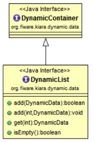  
<center>Figure: Interface DynamicList</center>

**Functions:**

- **add:** This function adds a `DynamicData` object into the list in the last position or in the position specified via parameter.
- **get**: This function returns a `DynamicData` object stored is a specific position in the list.
- **isEmpty**: This function returns true if the `DynamicList` is empty.

---
#### org.fiware.kiara.dynamic.data.DynamicSet

This class holds the data values of a DynamicData object created from a SetTypeDescriptor. A set can only have one dimension and it has a maximum length. All the DynamicData objects stored inside a DynamicSet must have been created from the same TypeDescriptor definition and it cannot be duplicated objects.

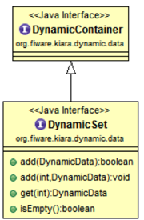  
<center>Figure: Interface DynamicSet</center>

**Functions:**

- **add:** This function adds a `DynamicData` object into the list in the last position or in the position specified via parameter.
- **get**: This function returns a `DynamicData` object stored is a specific position in the list.
- **isEmpty**: This function returns true if the `DynamicSet` is empty.

---
#### org.fiware.kiara.dynamic.data.DynamicMap

This class holds a list of pairs key-value instances of DynamicData. In a DynamicMap, the key values cannot be duplicated.

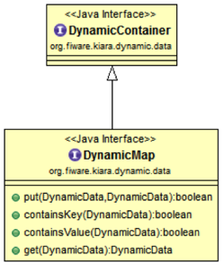  
<center>Figure: Interface DynamicMap</center>

**Functions:**

- **put:** This function adds a new key-value pair using the DynamicData objets introduces as parameters. It will return false if the key value already exists in the map.
- **containsKey**: This function returns true if the DynamicMap contains at least one key-value pair in which the key DynamicData object is equal to the one introduced as a parameter.
- **containsValue**: This function returns true if the DynamicMap contains at least one key-value pair in which the value DynamicData object is equal to the one introduced as a parameter.
- **get**: This function returns a DynamicData object from a key-value pair whose key is equal to the one introduced as a parameter.

---
#### org.fiware.kiara.dynamic.data.DynamicMembered

This class represents a `DynamicData` type formed by multiple `DynamicData` objects stored into a class named `DynamicMember`.

  
<center>Figure: Interface DynamicMembered</center>

**Functions:** None

---
#### org.fiware.kiara.dynamic.data.DynamicStruct

This class holds group of `DynamicData` objects acting as members of a stucture. Each member is identified by its name.

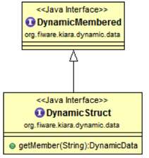  
<center>Figure: Interface DynamicStruct</center>

**Functions:**

- **getMember:** This function returns a `DynamicData` object (acting as a member of the structure) whose name is the same as the one introduced as a parameter.

---
#### org.fiware.kiara.dynamic.data.DynamicEnum

This class is used to dynamically manipulate enumerations described by a specific `EnumTypeDescriptor` object.

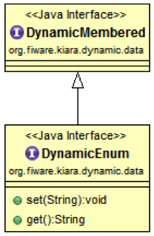  
<center>Figure: Interface DynamicEnum</center>

**Functions:**

- **set:** This function sets the actual value of the DynamicEnum object to the one specified as a parameter.
- **get**: This function returns the actual value of the DynamicEnum object.

---
#### org.fiware.kiara.dynamic.data.DynamicUnion

This class is used to dynamically manipulate unions described by a specific `UnionTypeDescriptor` object. A union is formed by some `DynamicData` objects, and the valid one is selected by using a discriminator.

  
<center>Figure: Interface DynamicUnion</center>

**Functions:**

- **\_d:** This function either returns the discriminator or sets a new one, depending on the existence of an object parameter indicating a new value.
- **getMember**: This function returns valid `DynamicData` value depending on the selected discriminator.
- **setMember**: This function sets the `DynamicData` object received as a parameter in the member whose name is the same as the one introduced (if and only if the discriminator value is correct).

---
#### org.fiware.kiara.dynamic.data.DynamicException

This class holds group of `DynamicData` objects acting as members of an exception. Each member is identified by its own name.

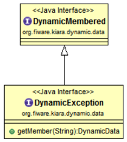  
<center>Figure: Interface DynamicException</center>

**Functions:**

- **getMember:** This function returns a `DynamicData` object whose name is the same as the one introduced as a parameter.

---
#### org.fiware.kiara.dynamic.data.DynamicMember

This class represents a dynamic member of any DynamicMembered object. It is used to store the DynamicData objects inside structures, unions, enumerations and exceptions.

  
<center>Figure: Interface DynamicMember</center>

**Functions:**

- **getName:** This function returns the member’s name.
- **getDynamicData**: This function returns the `DynamicData` stored inside a `DynamicMember` object.
- **equals**: It returns true if two `DynamicMember` objects are equal.

---
#### org.fiware.kiara.dynamic.service.DynamicFunctionRequest

This class represents a dynamic function request. This class is used to create objects whose objective is to invoke functions remotely.

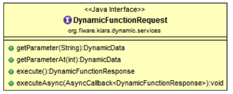  
<center>Figure: Interface DynamicFunctionRequest</center>

**Functions:**

- **getParameter:** This function returns a `DynamicData` object stored in the parameter list depending on its name or its position in such list.
- **execute**: This function executes a function remotely. It serializes all the necessary information and sends the request over the wire. It returns a `DynamicFunctionResponse` with the result.
- **executeAsync**: This function behaves the same way as the function `execute`. The only difference is that it needs a callback to be executed when the response arrives from the server.

---
#### org.fiware.kiara.dynamic.service.DynamicFunctionResponse

This class represents a dynamic function response. This class is used to retrieve the information sent from the server after a remote procedure call.

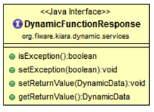  
<center>Figure: Interface DynamicFunctionResponse</center>

**Functions:**

- **isException:** This function returns true if the server raised an exception when executing the function.
- **setException**: This method sets the attribute indicating that an exception has been thrown on the server side.
- **setReturnValue**: This function sets a `DynamicData` object as a return value for the remote call.
- **getReturnValue**: This function returns the `DynamicData` representing the result of the remote call.

---
#### org.fiware.kiara.dynamic.service.DynamicProxy

This class represents a proxy than can be dynamically used to create an instance of DynamicFunctionRequest or a DynamicFunctionResponse depending if the user wants an object to execute a remote call or to store the result.

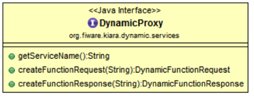  
<center>Figure: Interface DynamicProxy</center>

**Functions:**

- **getServiceName:** This function returns the service name.
- **createFunctionRequest**: This function creates a new object instance of `DynamicFunctionRequest` according to the `FunctionTypeDescriptor` that was used to describe it.
- **createFunctionResponse**: This function creates a new object instance of `DynamicFunctionResponse` according to the `FunctionTypeDescriptor` that was used to describe it.

---
#### org.fiware.kiara.dynamic.service.DynamicFunctionHandler

This class represents a dynamic object used to hold the implementation of a specific function. Its process method must be defined by the user when creating the object, and it will be used to register the service’s functions on the server’s side.

  
<center>Figure: Interface DynamicFunctionHandler</center>

**Functions:**

- **process:** This function is the one that will be registered to be executed when a client invokes remotely a function. It must be implemented by the user.


Detailed API
------------

This section defines in detail the API provided by the classes defined above.

### Main entry point

| **org.fiware.kiara.Kiara**                                               ||||
|-----------------------------------------------------------------------|-|-|-|
| **Attributes**                                                           ||||
| _Name_                   | _Type_       |                        |          |
| n/a                      | n/a          |                        |          |
| **Public Operations**                                                    ||||
| _Name_                   | _Parameters_ | _Returns/Type_         | _Raises_ |
| getTypeDescriptorBuilder |              | TypeDescriptorBuilder  |          |
| getDynamicValueBuilder   |              | DynamicValueBuilder    |          |
| createContext            |              | Context                |          |
| shutdown                 |              | void                   |          |


### Client API

This classes are those related to the client side API. This section includes all the relevant classes, attributes and methods.

| **org.fiware.kiara.client.Connection**                                ||||
|-----------------------------------------------------------------------|-|-|-|
| **Attributes**                                                           ||||
| _Name_            | _Type_         |                            |           |
| n/a               | n/a            |                            |           |
| **Public Operations**                                                    ||||
| _Name_            | _Parameters_   | _Returns/Type_             | _Raises_  |
| getTransport      |                | Transport                  |           |
| getSerializer     |                | Serializer                 |           |
| getServiceProxy   |                | T                          | Exception |
|                   | interfaceClass | Class\<T\>                 |           |
| getDynamicProxy   |                | DynamicProxy               |           |
|                   | name           | String                     |           |


### TypeDescriptor

This classes are those related to the client’s side API. This section includes all the relevant classes, attributes and methods.

| **org.fiware.kiara.typecode.TypeDescriptorBuilder**                      ||||
|-----------------------------------------------------------------------|-|-|-|
| **Attributes**                                                           ||||
| _Name_              | _Type_            |                         |         |
| n/a                 | n/a               |                         |         |
| **Public Operations**                                                    ||||
| _Name_              | _Parameters_      | _Returns/Type_          | _Raises_|
| createVoidType      |                   | DataTypeDescriptor      |         |
| createPrimitiveType |                   | PrimitiveTypeDescriptor |         |
|                     | kind              | TypeKind                |         |
| createArrayType     |                   | ArrayTypeDescriptor     |         |
|                     | contentDescriptor | DataTypeDescriptor      |         |
|                     | dimensions        | int[]                   |         |
| createListType      |                   | ListTypeDescriptor      |         |
|                     | contentDescriptor | DataTypeDescriptor      |         |
|                     | maxSize           | int                     |         |
| createSetType       |                   | SetTypeDescriptor       |         |
|                     | contentDescriptor | DataTypeDescriptor      |         |
|                     | maxSize           | int                     |         |
| createMapType       |                   | MapTypeDescriptor       |         |
|                     | keyDescriptor     | DataTypeDescriptor      |         |
|                     | valueDescriptor   | DataTypeDescriptor      |         |
|                     | maxSize           | int                     |         |
| createStructType    |                   | StructTypeDescriptor    |         |
|                     | name              | String                  |         |
| createEnumType      |                   | EnumTypeDescriptor      |         |
|                     | name              | String                  |         |
|                     | values            | String[]                |         |
| createUnionType     |                   | UnionTypeDescriptor     |         |
|                     | name              | String                  |         |
|                     | discriminatorDesc | DataTypeDescriptor      |         |
| createExceptionType |                   | ExceptionTypeDescriptor |         |
|                     | name              | String                  |         |
| createFunctionType  |                   | FunctionTypeDescriptor  |         |
|                     | name              | String                  |         |
| createServiceType   |                   | ServiceTypeDescriptor   |         |
|                     | name              | String                  |         |
|                     | scopedName        | String                  |         |

| **org.fiware.kiara.typecode.TypeDescriptor**                             ||||
|-----------------------------------------------------------------------|-|-|-|
| **Attributes**                                                           ||||
| _Name_            | _Type_         |                              |         |
| n/a               | n/a            |                              |         |
| **Public Operations**                                                    ||||
| _Name_            | _Parameters_   | _Returns/Type_               | _Raises_|
| getKind           |                | TypeKind                     |         |
| isData            |                | boolean                      |         |
| isPrimitive       |                | boolean                      |         |
| isVoid            |                | boolean                      |         |
| isContainer       |                | boolean                      |         |
| isArray           |                | boolean                      |         |
| isList            |                | boolean                      |         |
| isMap             |                | boolean                      |         |
| isSet             |                | boolean                      |         |
| isMembered        |                | boolean                      |         |
| isEnum            |                | boolean                      |         |
| isUnion           |                | boolean                      |         |
| isStruct          |                | boolean                      |         |
| isException       |                | boolean                      |         |
| isService         |                | boolean                      |         |
| isFunction        |                | boolean                      |         |


| **org.fiware.kiara.typecode.data.DataTypeDescriptor**                    ||||
|-----------------------------------------------------------------------|-|-|-|
| **Attributes**                                                           ||||
| _Name_              | _Type_            |                         |         |
| n/a                 | n/a               |                         |         |
| **Public Operations**                                                    ||||
| _Name_              | _Parameters_      | _Returns/Type_          | _Raises_|
| n/a                   |                   |                         |         |


| **org.fiware.kiara.typecode.data.PrimitiveTypeDescriptor**               ||||
|-----------------------------------------------------------------------|-|-|-|
| **Attributes**                                                           ||||
| _Name_            | _Type_         |                              |         |
| n/a               | n/a            |                              |         |
| **Public Operations**                                                    ||||
| _Name_            | _Parameters_   | _Returns/Type_               | _Raises_|
| isString          |                | boolean                      |         |
| setMaxFixedLength |                | PrimitiveTypeDescriptor      |         |
|                   | length         | int                          |         |
| getMaxFixedLength |                | int                          |         |


| **org.fiware.kiara.typecode.data.ContainerTypeDescriptor**               ||||
|-----------------------------------------------------------------------|-|-|-|
| **Attributes**                                                           ||||
| _Name_        | _Type_           |                                |         |
| n/a           | n/a              |                                |         |
| **Public Operations**                                                    ||||
| _Name_        | _Parameters_     | _Returns/Type_                 | _Raises_|
| setMaxSize    |                  | void                           |         |
|               | length           | int                            |         |
| getMaxSize    |                  | int                            |         |


| **org.fiware.kiara.typecode.data.ArrayTypeDescriptor**                   ||||
|-----------------------------------------------------------------------|-|-|-|
| **Attributes**                                                           ||||
| _Name_              | _Type_            |                         |         |
| n/a                 | n/a               |                         |         |
| **Public Operations**                                                    ||||
| _Name_              | _Parameters_      | _Returns/Type_          | _Raises_|
| getElementType      |                   | DataTypeDescriptor      |         |
| setElementType      |                   | boolean                 |         |
|                     | contentType       | DataTypeDescriptor      |         |
| setDimensions       |                   | void                    |         |
|                     | dimensions        | int[]                   |         |
| getDimensions       |                   | List\<Integer\>         |         |


| **org.fiware.kiara.typecode.data.ListTypeDescriptor**                    ||||
|-----------------------------------------------------------------------|-|-|-|
| **Attributes**                                                           ||||
| _Name_              | _Type_            |                         |         |
| n/a                 | n/a               |                         |         |
| **Public Operations**                                                    ||||
| _Name_              | _Parameters_      | _Returns/Type_          | _Raises_|
| getElementType      |                   | DataTypeDescriptor      |         |
| setElementType      |                   | boolean                 |         |
|                     | contentType       | DataTypeDescriptor      |         |


| **org.fiware.kiara.typecode.data.SetTypeDescriptor**                    ||||
|-----------------------------------------------------------------------|-|-|-|
| **Attributes**                                                           ||||
| _Name_              | _Type_            |                         |         |
| n/a                 | n/a               |                         |         |
| **Public Operations**                                                    ||||
| _Name_              | _Parameters_      | _Returns/Type_          | _Raises_|
| getElementType      |                   | DataTypeDescriptor      |         |
| setElementType      |                   | boolean                 |         |
|                     | contentType       | DataTypeDescriptor      |         |


| **org.fiware.kiara.typecode.data.MapTypeDescriptor**                   ||||
|-----------------------------------------------------------------------|-|-|-|
| **Attributes**                                                           ||||
| _Name_                 | _Type_              |                    |         |
| n/a                    | n/a                 |                    |         |
| **Public Operations**                                                    ||||
| _Name_                 | _Parameters_        | _Returns/Type_     | _Raises_|
| setKeyTypeDescriptor   |                     | boolean            |         |
|                        | keyTypeDescriptor   | DataTypeDescriptor |         |
| getKeyTypeDescriptor   |                     | DataTypeDescriptor |         |
| setValueTypeDescriptor |                     | boolean            |         |
|                        | valueTypeDescriptor | DataTypeDescriptor |         |
| getValueTypeDescriptor |                     | DataTypeDescriptor |         |

| **org.fiware.kiara.typecode.data.MemberedTypeDescriptor**                ||||
|-----------------------------------------------------------------------|-|-|-|
| **Attributes**                                                           ||||
| _Name_              | _Type_            |                         |         |
| n/a                 | n/a               |                         |         |
| **Public Operations**                                                    ||||
| _Name_              | _Parameters_      | _Returns/Type_          | _Raises_|
| getMembers          |                   | List\<Member\>          |         |
| getName             |                   | String                  |         |


| **org.fiware.kiara.typecode.data.StructTypeDescriptor**                  ||||
|-----------------------------------------------------------------------|-|-|-|
| **Attributes**                                                           ||||
| _Name_              | _Type_            |                         |         |
| n/a                 | n/a               |                         |         |
| **Public Operations**                                                    ||||
| _Name_              | _Parameters_      | _Returns/Type_          | _Raises_|
| addMember           |                   | void                    |         |
|                     | member            | TypeDescriptor          |         |
|                     | name              | String                  |         |
| getMember           |                   | DataTypeDescriptor      |         |
|                     | name              | String                  |         |


| **org.fiware.kiara.typecode.data.EnumTypeDescriptor**                    ||||
|-----------------------------------------------------------------------|-|-|-|
| **Attributes**                                                           ||||
| _Name_              | _Type_            |                         |         |
| n/a                 | n/a               |                         |         |
| **Public Operations**                                                    ||||
| _Name_              | _Parameters_      | _Returns/Type_          | _Raises_|
| addValue            |                   | void                    |         |
|                     | value             | String                  |         |


| **org.fiware.kiara.typecode.data.UnionTypeDescriptor**                   ||||
|-----------------------------------------------------------------------|-|-|-|
| **Attributes**                                                           ||||
| _Name_              | _Type_            |                         |         |
| n/a                 | n/a               |                         |         |
| **Public Operations**                                                    ||||
| _Name_              | _Parameters_      | _Returns/Type_          | _Raises_|
| addMember           |                   | UnionTypeDescriptor     |         |
|                     | typeDescriptor    | DataTypeDescriptor      |         |
|                     | name              | String                  |         |
|                     | isDefault         | boolean                 |         |
|                     | labels            | Object[]                |         |


| **org.fiware.kiara.typecode.data.FunctionTypeDescriptor**                ||||
|-----------------------------------------------------------------------|-|-|-|
| **Attributes**                                                           ||||
| _Name_              | _Type_            |                         |         |
| n/a                 | n/a               |                         |         |
| **Public Operations**                                                    ||||
| _Name_              | _Parameters_      | _Returns/Type_          | _Raises_|
| getReturnType       |                   | DataTypeDescriptor      |         |
| setReturnType       |                   | void                    |         |
|                     | returnType        | DataTypeDescriptor      |         |
| getParameter        |                   | DataTypeDescriptor      |         |
|                     | name              | String                  |         |
| addParameter        |                   | void                    |         |
|                     | parameter         | DataTypeDescriptor      |         |
|                     | name              | String                  |         |
| getException        |                   | ExceptionTypeDescriptor |         |
|                     | name              | String                  |         |
| addException        |                   | void                    |         |
|                     | exception         | ExceptionTypeDescriptor |         |
| getName             |                   | String                  |         |
| getServiceName      |                   | String                  |         |
| setServiceName      |                   | FunctionTypeDescriptor  |         |
|                     | serviceName       | String                  |         |


| **org.fiware.kiara.typecode.data.ServiceTypeDescriptor**                 ||||
|-----------------------------------------------------------------------|-|-|-|
| **Attributes**                                                           ||||
| _Name_        | _Type_           |                                |         |
| n/a           | n/a              |                                |         |
| **Public Operations**                                                    ||||
| _Name_        | _Parameters_     | _Returns/Type_                 | _Raises_|
| getName       |                  | String                         |         |
| getScopedName |                  | String                         |         |
| getFunctions  |                  | List\<FunctionTypeDescriptor\> |         |
| addFunction   |                  | void                           |         |
|               | functionTypeDesc | FunctionTypeDescriptor         |         |


### Dynamic

The following classes are those related to creation and management of dynamic types, including data definition and function description and execution.

| **org.fiware.kiara.dynamic.DynamicValueBuilder**                         ||||
|-----------------------------------------------------------------------|-|-|-|
| **Attributes**                                                           ||||
| _Name_        | _Type_           |                                |         |
| n/a           | n/a              |                                |         |
| **Public Operations**                                                    ||||
| _Name_                 | _Parameters_       | _Returns/Type_      | _Raises_|
| createData             |                    | DynamicData            |      |
|                        | dataDescriptor     | DataTypeDescriptor     |      |
| createFunctionRequest  |                    | DynamicFunctionRequest |      |
|                        | functionDescriptor | FunctionTypeDescriptor |      |
|                        | serializer         | Serializer             |      |
|                        | transport          | Transport              |      |
| createFunctionRequest  |                    | DynamicFunctionRequest |      |
|                        | functionDescriptor | FunctionTypeDescriptor |      |
| createFunctionResponse |                    | DynamicFunctionResponse|      |
|                        | functionDescriptor | FunctionTypeDescriptor |      |
|                        | serializer         | Serializer             |      |
|                        | transport          | Transport              |      |
| createFunctionResponse |                    | DynamicFunctionResponse|      |
|                        | functionDescriptor | FunctionTypeDescriptor |      |
| createService          |                    | DynamicProxy           |      |
|                        | serviceDescriptor  | ServiceTypeDescriptor  |      |
|                        | serializer         | Serializer             |      |
|                        | transport          | Transport              |      |


| **org.fiware.kiara.dynamic.DynamicValue**                                ||||
|-----------------------------------------------------------------------|-|-|-|
| **Attributes**                                                           ||||
| _Name_            | _Type_         |                          |             |
| n/a               | n/a            |                          |             |
| **Public Operations**                                                    ||||
| _Name_            | _Parameters_   | _Returns/Type_           | _Raises_    |
| getTypeDescriptor |                | TypeDescriptor           |             |
| serialize         |                | void                     | IOException |
|                   | impl           | SerializerImpl           |             |
|                   | message        | BinaryOutputStream       |             |
|                   | name           | String                   |             |
| deserialize       |                | void                     | IOException |
|                   | impl           | SerializerImpl           |             |
|                   | message        | BinaryInputStream        |             |
|                   | name           | String                   |             |


| **org.fiware.kiara.dynamic.data.DynamicData**                            ||||
|-----------------------------------------------------------------------|-|-|-|
| **Attributes**                                                           ||||
| _Name_              | _Type_            |                         |         |
| n/a                 | n/a               |                         |         |
| **Public Operations**                                                    ||||
| _Name_              | _Parameters_      | _Returns/Type_          | _Raises_|
| n/a                   |                   |                         |         |

| **org.fiware.kiara.dynamic.data.DynamicPrimitive**                  ||||
|-----------------------------------------------------------------------|-|-|-|
| **Attributes**                                                           ||||
| _Name_        | _Type_           |                                |         |
| n/a           | n/a              |                                |         |
| **Public Operations**                                                    ||||
| _Name_        | _Parameters_     | _Returns/Type_                 | _Raises_|
| set           |                  | boolean                        |         |
|               | value            | Object                         |         |
| get           |                  | Object                         |         |
| set           |                  | boolean                        |         |
|               | value            | DynamicData                    |         |


| **org.fiware.kiara.dynamic.data.DynamicContainer**                       ||||
|-----------------------------------------------------------------------|-|-|-|
| **Attributes**                                                           ||||
| _Name_              | _Type_            |                         |         |
| n/a                 | n/a               |                         |         |
| **Public Operations**                                                    ||||
| _Name_              | _Parameters_      | _Returns/Type_          | _Raises_|
| n/a                   |                   |                         |         |


| **org.fiware.kiara.dynamic.data.DynamicArray**                           ||||
|-----------------------------------------------------------------------|-|-|-|
| **Attributes**                                                           ||||
| _Name_        | _Type_           |                                |         |
| n/a           | n/a              |                                |         |
| **Public Operations**                                                    ||||
| _Name_        | _Parameters_     | _Returns/Type_                 | _Raises_|
| getElement    |                  | DynamicData                    |         |
|               | position         | int[]                          |         |
| setElementAt  |                  | boolean                        |         |
|               | value            | DynamicData                    |         |
|               | position         | int[]                          |         |


| **org.fiware.kiara.dynamic.data.DynamicList**                            ||||
|-----------------------------------------------------------------------|-|-|-|
| **Attributes**                                                           ||||
| _Name_        | _Type_           |                                |         |
| n/a           | n/a              |                                |         |
| **Public Operations**                                                    ||||
| _Name_        | _Parameters_     | _Returns/Type_                 | _Raises_|
| add           |                  | boolean                        |         |
|               | element          | DynamicData                    |         |
| add           |                  | void                           |         |
|               | index            | int                            |         |
|               | element          | DynamicData                    |         |
| get           |                  | DynamicData                    |         |
|               | index            | int                            |         |
| isEmpty       |                  | boolean                        |         |


| **org.fiware.kiara.dynamic.data.DynamicSet**                             ||||
|-----------------------------------------------------------------------|-|-|-|
| **Attributes**                                                           ||||
| _Name_        | _Type_           |                                |         |
| n/a           | n/a              |                                |         |
| **Public Operations**                                                    ||||
| _Name_        | _Parameters_     | _Returns/Type_                 | _Raises_|
| add           |                  | boolean                        |         |
|               | element          | DynamicData                    |         |
| add           |                  | void                           |         |
|               | index            | int                            |         |
|               | element          | DynamicData                    |         |
| get           |                  | DynamicData                    |         |
|               | index            | int                            |         |
| isEmpty       |                  | boolean                        |         |


| **org.fiware.kiara.dynamic.data.DynamicMap**                             ||||
|-----------------------------------------------------------------------|-|-|-|
| **Attributes**                                                           ||||
| _Name_        | _Type_           |                                |         |
| n/a           | n/a              |                                |         |
| **Public Operations**                                                    ||||
| _Name_        | _Parameters_     | _Returns/Type_                 | _Raises_|
| put           |                  | boolean                        |         |
|               | key              | DynamicData                    |         |
|               | value            | DynamicData                    |         |
| containsKey   |                  | boolean                        |         |
|               | key              | DynamicData                    |         |
| containsValue |                  | boolean                        |         |
|               | value            | DynamicData                    |         |
| get           |                  | DynamicData                    |         |
|               | key              | DynamicData                    |         |

| **org.fiware.kiara.dynamic.data.DynamicMembered**                        ||||
|-----------------------------------------------------------------------|-|-|-|
| **Attributes**                                                           ||||
| _Name_              | _Type_            |                         |         |
| n/a                 | n/a               |                         |         |
| **Public Operations**                                                    ||||
| _Name_              | _Parameters_      | _Returns/Type_          | _Raises_|
| n/a                   |                   |                         |         |


| **org.fiware.kiara.dynamic.data.DynamicStruct**                          ||||
|-----------------------------------------------------------------------|-|-|-|
| **Attributes**                                                           ||||
| _Name_        | _Type_           |                                |         |
| n/a           | n/a              |                                |         |
| **Public Operations**                                                    ||||
| _Name_        | _Parameters_     | _Returns/Type_                 | _Raises_|
| getMember     |                  | DynamicData                    |         |
|               | name             | String                         |         |


| **org.fiware.kiara.dynamic.data.DynamicEnum**                            ||||
|-----------------------------------------------------------------------|-|-|-|
| **Attributes**                                                           ||||
| _Name_        | _Type_           |                                |         |
| n/a           | n/a              |                                |         |
| **Public Operations**                                                    ||||
| _Name_        | _Parameters_     | _Returns/Type_                 | _Raises_|
| set           |                  | void                           |         |
|               | value            | String                         |         |
| get           |                  | String                         |         |


| **org.fiware.kiara.dynamic.data.Dynamic**                                ||||
|-----------------------------------------------------------------------|-|-|-|
| **Attributes**                                                           ||||
| _Name_        | _Type_           |                                |         |
| n/a           | n/a              |                                |         |
| **Public Operations**                                                    ||||
| _Name_        | _Parameters_     | _Returns/Type_                 | _Raises_|
| \_d           |                  | void                           |         |
|               | value            | Object                         |         |
| \_d           |                  | Object                         |         |
| getMember     |                  | DynamicData                    |         |
|               | name             | String                         |         |
| setMember     |                  | void                           |         |
|               | name             | String                         |         |
|               | data             | DynamicData                    |         |


| **org.fiware.kiara.dynamic.data.DynamicException**                       ||||
|-----------------------------------------------------------------------|-|-|-|
| **Attributes**                                                           ||||
| _Name_        | _Type_           |                                |         |
| n/a           | n/a              |                                |         |
| **Public Operations**                                                    ||||
| _Name_        | _Parameters_     | _Returns/Type_                 | _Raises_|
| getMember     |                  | DynamicData                    |         |
|               | name             | String                         |         |


| **org.fiware.kiara.dynamic.data.DynamicMember**                          ||||
|-----------------------------------------------------------------------|-|-|-|
| **Attributes**                                                           ||||
| _Name_         | _Type_         |                                 |         |
| n/a            | n/a            |                                 |         |
| **Public Operations**                                                    ||||
| _Name_         | _Parameters_   | _Returns/Type_                  | _Raises_|
| getName        |                | String                          |         |
| getDynamicData |                | DynamicData                     |         |
| equals         |                | boolean                         |         |
|                | anotherObject  | Object                          |         |


| **org.fiware.kiara.dynamic.service.DynamicFunctionRequest**              ||||
|-----------------------------------------------------------------------|-|-|-|
| **Attributes**                                                           ||||
| _Name_         | _Type_         |                                 |         |
| n/a            | n/a            |                                 |         |
| **Public Operations**                                                    ||||
| _Name_         | _Parameters_   | _Returns/Type_                  | _Raises_|
| getParameter   |                | DynamicData                     |         |
|                | name           | String                          |         |
| getParameterAt |                | DynamicData                     |         |
|                | index          | int                             |         |
| execute        |                | DynamicFunctionResponse         |         |
| executeAsync   |                | void                            |         |
|                | callback       | AsyncCallback\<DynamicFunctionResponse\> ||


| **org.fiware.kiara.dynamic.service.DynamicFunctionResponse**             ||||
|-----------------------------------------------------------------------|-|-|-|
| **Attributes**                                                           ||||
| _Name_         | _Type_         |                                 |         |
| n/a            | n/a            |                                 |         |
| **Public Operations**                                                    ||||
| _Name_         | _Parameters_   | _Returns/Type_                  | _Raises_|
| isException    |                | boolean                         |         |
| setException   |                | void                            |         |
|                | isException    | boolean                         |         |
| setReturnValue |                | void                            |         |
|                | returnType     | DynamicData                     |         |
| getReturnValue |                | DynamicData                     |         |


| **org.fiware.kiara.dynamic.service.DynamicProxy**                        ||||
|-----------------------------------------------------------------------|-|-|-|
| **Attributes**                                                           ||||
| _Name_         | _Type_         |                                 |         |
| n/a            | n/a            |                                 |         |
| **Public Operations**                                                    ||||
| _Name_                 | _Parameters_   | _Returns/Type_          | _Raises_|
| getServiceName         |                | String                  |         |
| createFunctionRequest  |                | DynamicFunctionRequest  |         |
|                        | name           | String                  |         |
| createFunctionReqponse |                | DynamicFunctionResponse |         |
|                        | name           | String                  |         |


| **org.fiware.kiara.dynamic.service.DynamicFunctionRequest**              ||||
|-----------------------------------------------------------------------|-|-|-|
| **Attributes**                                                           ||||
| _Name_         | _Type_         |                                 |         |
| n/a            | n/a            |                                 |         |
| **Public Operations**                                                    ||||
| _Name_         | _Parameters_   | _Returns/Type_                  | _Raises_|
| process        |                | void                            |         |
|                | request        | DynamicFunctionRequest          |         |
|                | response       | DynamicFunctionResponse         |         |


